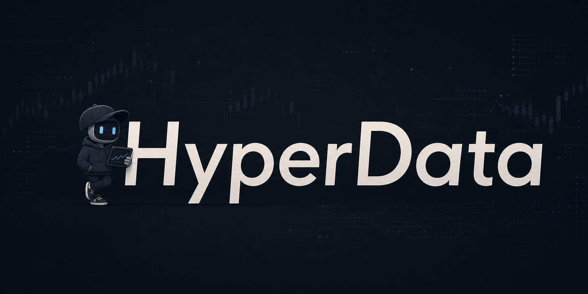

<div align="center">



**Real-time crypto market intelligence, right in your terminal.**

[](https://github.com/Co-Messi/HyperData-Terminal/actions)
[](LICENSE)
[](https://python.org)
[](#data-sources)

Stream live data from Hyperliquid, Binance, Bybit, OKX, and Deribit. Track whale positions, monitor liquidation cascades, analyze order flow, and paper trade your own strategies — all from one command.


</div>

---

## What is HyperData Terminal?

HyperData Terminal is an open-source crypto market data platform that connects to 5 exchanges via WebSocket and renders everything in a beautiful Rich terminal UI. No browser needed — just your terminal.

It comes with:

- **5 live dashboards** that update in real-time
- **A REST API** so you can build your own tools on top
- **A paper trading engine** where you plug in your own strategies and trade with fake money on real prices
- **An LLM agent** that asks any AI model (GPT, Ollama, Groq) whether to buy or sell based on live market conditions

Zero API keys required to get started. All exchange data comes from public WebSocket feeds.

---

## Features

| | Feature | Description |
|---|---|---|
| :chart_with_upwards_trend: | **6 Terminal Dashboards** | Liquidation watch, liquidation stream, liquidation heatmap, order flow (CVD), market overview, whale tracker |
| :satellite: | **14 Data Components** | Liquidations from 4 exchanges, CVD orderflow, whale positions, funding rates, open interest, orderbook depth, DVOL IV, long/short ratios, spot prices, smart money signals |
| :globe_with_meridians: | **REST API + WebSocket** | 17+ endpoints for market data, real-time event streaming |
| :moneybag: | **Paper Trading** | Pluggable strategy engine — real market data, fake money. Write your own strategy in ~30 lines. |
| :robot: | **LLM Agent** | AI-powered trading decisions via any OpenAI-compatible API (GPT-4o, Llama 3, Mixtral, etc.) |
| :white_check_mark: | **Self-Verifying Data** | Continuously cross-checks live data against Binance/Deribit, checks every feed *per venue*, and flags stale or partial data — the dashboard shows ✓ LIVE / ⚠ PARTIAL / ⚠ STALE / ⚠ DRIFT, and `/v1/health` exposes it. See [docs/DATA_INTEGRITY.md](docs/DATA_INTEGRITY.md). |
| :zap: | **Zero Config** | No API keys needed for basic functionality. `pip install` and go. |

---

## Quick Start

```bash
# Clone and install
git clone https://github.com/Co-Messi/HyperData-Terminal.git
cd HyperData-Terminal
pip install -e .

# Run
hyperdata
```

That's it. Live data from 5 exchanges, rendered in your terminal.

---

## Dashboards

```bash
hyperdata
```

That's it. An interactive menu lets you pick which dashboard to view:

```
  [1]  Liquidation Watch       BTC positions closest to liquidation
  [2]  Liquidation Stream      Multi-exchange liquidation feed
  [3]  Liquidation Heatmap     Price-level liquidation risk (all cryptos)
  [4]  CVD Order Flow          BTC cumulative volume delta & signals
  [5]  Market Overview         Funding rates, OI, prices for all assets
  [6]  Whale Tracker           Largest open positions on Hyperliquid
  [0]  All Dashboards          Combined view — everything at once

  Press Ctrl+C to return to menu.
```

### Dashboard Descriptions

| Dashboard | What it shows |
|---|---|
| **Liquidation Watch** | BTC positions closest to liquidation on Hyperliquid. Tracks distance-to-liquidation in real time so you can see which whales are about to get wiped. |
| **Liquidation Stream** | Multi-exchange liquidation feed from Hyperliquid, Binance, Bybit, and OKX, with size, price, and exchange. Coverage is honest, not a complete census: OKX/Bybit are real feeds (Bybit top-15 symbols), Binance's stream is throttled to ~1 liq/symbol/sec at the source, and Hyperliquid is *inferred* from large trades (flagged as estimated). See [docs/DATA_INTEGRITY.md](docs/DATA_INTEGRITY.md). |
| **CVD Order Flow** | Cumulative Volume Delta for BTC — see whether buyers or sellers are in control. Tracks buy volume vs sell volume from Hyperliquid **and** Binance Futures WebSocket trades, always shown with per-venue attribution (`CVD: +1.2M [HL +0.1M \| BN +1.1M]`). **Regional caveat:** Binance Futures streams are geo-blocked in some regions (e.g. the US, Singapore); there the socket connects but never delivers data. The terminal detects this and says so — the CVD reads `[HL … \| BN silent]`, the header badge shows ⚠ PARTIAL, and `/v1/health` reports `order_flow_binance: warn`. It never presents single-venue flow as two-venue flow. |
| **Market Overview** | Funding rates, open interest, and prices for 50 assets across exchanges. Spot divergences and funding extremes at a glance. |
| **Liquidation Heatmap** | Price-level visualization of where liquidations are concentrated. Red bars = long liquidation risk (price drops), green bars = short liquidation risk (price rises). Like Coinglass, but free and in your terminal. |
| **Whale Tracker** | Largest open positions on Hyperliquid. See what the biggest players are doing — their size, entry price, PnL, and liquidation price. |

---

## REST API

Start the API server alongside or instead of the terminal:

```bash
python run_api.py --port 8420
```

> **⚠️ Security: local-only by default.** The API binds to `127.0.0.1` and is
> intended for loopback use. It serves wallet-derived positions, liquidation
> danger zones, and live order flow — trading intelligence you should not
> expose to a LAN or the internet. A non-loopback bind
> (`HYPERDATA_API_HOST=0.0.0.0`) is **refused** unless you either set
> `HYPERDATA_API_KEY=<secret>` (all non-health routes then require
> `Authorization: Bearer <secret>` or `X-API-Key`) or explicitly accept the
> risk with `HYPERDATA_UNSAFE_PUBLIC_API=1`. Browsers get **no** cross-origin
> access by default on any bind — loopback is not a boundary against a web
> page you happen to have open, which could otherwise `fetch()` your tracked
> wallets. To let a local web UI read the API (REST and WebSocket alike), set
> `HYPERDATA_CORS_ORIGINS=http://localhost:3000`. On a loopback bind the
> `Host` header must also be loopback (DNS-rebinding guard). Do not front
> this API with a public tunnel or reverse proxy without auth and rate
> limiting of your own.

### Endpoints

| Endpoint | Description |
|---|---|
| `GET /v1/live` | Minimal liveness probe (always unauthenticated) |
| `GET /v1/health` | Server status and uptime (requires the API key when one is set). `status` is `initializing` until the first self-verification run, then `ok`, `warn` (something missing — e.g. one order-flow venue silent) or `degraded` (stale feed, drift, or a failed component). Never `ok` for a terminal that is not. |
| `GET /v1/market` | All assets — prices, OI, funding |
| `GET /v1/market/{symbol}` | Single asset detail |
| `GET /v1/liquidations` | Recent liquidation events |
| `GET /v1/liquidations/stats` | Aggregate liquidation statistics |
| `GET /v1/orderflow/{symbol}` | CVD snapshots for a symbol |
| `GET /v1/funding-rates` | Funding rates across exchanges |
| `GET /v1/funding-rates/{symbol}` | Single asset funding rate |
| `GET /v1/long-short-ratio` | Long/short ratio |
| `GET /v1/basis` | Basis spread |
| `GET /v1/deribit/iv` | DVOL implied volatility |
| `GET /v1/orderbook/{symbol}` | Orderbook snapshot |
| `GET /v1/whales` | Top whale positions |
| `GET /v1/positions/danger-zone` | Positions closest to liquidation |
| `GET /v1/public/metrics` | Server metrics and component health |
| `WS /v1/ws` | Real-time event stream (liquidations, trades, signals) |

```bash
# Examples
curl http://localhost:8420/v1/market/BTC | python -m json.tool
curl http://localhost:8420/v1/orderflow/BTC
curl http://localhost:8420/v1/liquidations/stats
curl http://localhost:8420/v1/positions/danger-zone
```

---

## Paper Trading

HyperData Terminal includes a paper trading engine that uses **real market data** with **fake money**. Write your own strategy, plug it in, and watch it trade.

### Write Your Own Strategy

Create a file in `src/strategies/examples/`:

```python
from src.strategies.base import Strategy, Signal

class MyStrategy(Strategy):
    name = "my_strategy"

    def evaluate(self, hub) -> Signal | None:
        # Access any live market data via hub:
        #   hub.orderflow    — CVD, buy/sell volume
        #   hub.market       — prices, OI, funding
        #   hub.liquidations — recent liquidation events
        #   hub.funding      — funding rates by exchange
        #   hub.lsr          — long/short ratios
        #   hub.positions    — whale positions (Hyperliquid)
        #   hub.spot         — spot prices
        #   hub.deribit      — DVOL implied volatility

        snap = hub.orderflow.get_snapshot("BTC", "5m")
        if not snap:
            return None

        cvd = snap.buy_volume - snap.sell_volume
        if cvd > 100_000:
            return Signal("BTC", "BUY", size_usd=100, confidence=0.7, reason="Strong buy pressure")
        elif cvd < -100_000:
            return Signal("BTC", "SELL", size_usd=100, confidence=0.7, reason="Strong sell pressure")

        return None
```

That's the entire interface. One class, one method, one return type.

### Included Example Strategies

| Strategy | Data Source | Logic |
|---|---|---|
| `CVDMomentum` | `hub.orderflow` | Buy when order flow is strongly positive, sell when negative |
| `FundingRateArb` | `hub.funding` | Short when funding rate is high, long when negative |
| `LiquidationCascade` | `hub.liquidations` | Buy the dip after large liquidation cascades |
| `WhaleFollow` | `hub.positions` | Mirror the direction of the largest whale positions |

### LLM Agent

The LLM agent sends a market data summary to any OpenAI-compatible API and asks for trading decisions:

```bash
# Set up in .env
LLM_BASE_URL=https://api.openai.com/v1    # or http://localhost:11434/v1 for Ollama
LLM_MODEL=gpt-4o                           # or llama3, mixtral, etc.
LLM_API_KEY=sk-...
```

Works with OpenAI, Ollama (local), LM Studio, Groq, Together, or any provider with an OpenAI-compatible API. Customize the prompt in `src/strategies/llm_agent.py`.

---

## Configuration

```bash
cp .env.example .env
```

| Variable | Required | Description |
|---|---|---|
| `LLM_BASE_URL` | For LLM agent | OpenAI-compatible API endpoint |
| `LLM_MODEL` | For LLM agent | Model name (gpt-4o, llama3, etc.) |
| `LLM_API_KEY` | For LLM agent | API key |
| `BINANCE_API_KEY` | No | Enhances market data quality |
| `TELEGRAM_BOT_TOKEN` | No | Alert notifications via Telegram |
| `DISCORD_WEBHOOK_URL` | No | Alert notifications via Discord |

---

## Data Sources

All data is fetched live from public exchange APIs. No keys required.

| Source | Data | Connection |
|---|---|---|
| **Hyperliquid** | Positions, liquidations, funding, whale tracking | WebSocket + REST |
| **Binance** | Trades, liquidations (Futures streams — geo-blocked in some regions; reported as `silent`, never hidden) | WebSocket |
| **Bybit** | Liquidations | WebSocket |
| **OKX** | Liquidations | WebSocket |
| **Deribit** | DVOL implied volatility | REST |

---

## Architecture

```
Exchanges (Hyperliquid, Binance, Bybit, OKX, Deribit)
    |  WebSocket + REST (public feeds, no keys needed)
    v
HyperDataHub (14 data components)
    |
    +---> Terminal Dashboards (Rich TUI)
    +---> REST API + WebSocket (/v1/*)
    +---> Paper Trading Engine (pluggable strategies)
```

The hub owns all data components and manages their async lifecycles. Dashboards and API both read from the same hub — zero duplication.

---

## Tests

```bash
python -m pytest tests/ -v                                    # All tests
python -m pytest tests/ -v --ignore=tests/test_position_scanner.py  # Skip live exchange tests
python -m pytest tests/test_orderflow.py -v                   # Single test
```

---

## Contributing

1. Fork the repo
2. Create a feature branch (`git checkout -b feature/my-feature`)
3. Make your changes
4. Run tests (`python -m pytest tests/ -v`)
5. Run linter (`ruff check src/`)
6. Commit and push
7. Open a Pull Request

---

## License

Apache License 2.0 — see [LICENSE](LICENSE) for details.
